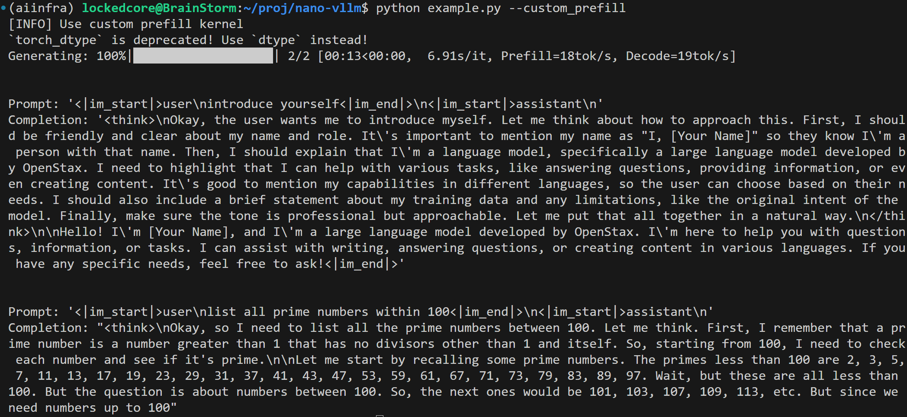

# Nano-VLLM (Custom Edition)

这是一个基于[nano-vllm](https://github.com/vllm-project/vllm)魔改的轻量级大模型推理引擎。

本项目的核心贡献在于实现并集成了一个手写的、基于 CUDA WMMA (Tensor Core) 的高性能 BFloat16 Prefill 注意力算子。通过这个算子，成功打通了从底层硬件寄存器布局到高层 Paged Attention 推理框架的全链路。

## 快速开始

### 1. 编译安装
原生nano-vllm的配置请参考[原repo](https://github.com/vllm-project/vllm).
首先，需要编译并安装自定义的 CUDA 扩展包：
```bash
cd nanovllm/custom && python setup.py instal
```

### 2. 运行基础示例

```bash
python example.py --custom_prefill
```

运行结果：



