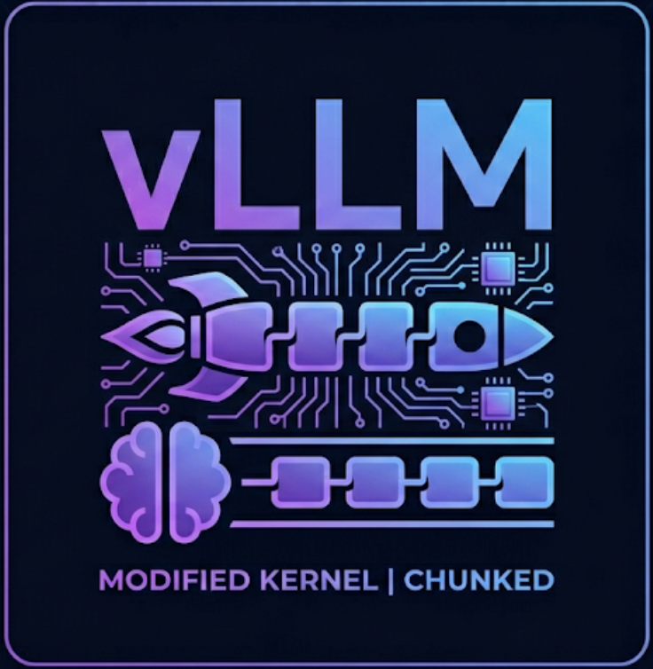

<p align="center">
  
</p>

# Nano-VLLM-ly (Custom Edition)

这是一个基于[nano-vllm](https://github.com/GeeeekExplorer/nano-vllm)魔改的轻量级大模型推理引擎。

本项目的核心贡献在于实现并集成了一个手写的、基于 CUDA WMMA (Tensor Core) 的高性能 BFloat16 Prefill 注意力算子。通过这个算子，成功打通了从底层硬件寄存器布局到高层 Paged Attention 推理框架的全链路。

## 快速开始

### 1. 编译安装

原生nano-vllm的配置请参考[原repo](https://github.com/GeeeekExplorer/nano-vllm).

要使用自定义的kernel，首先需要编译并安装 CUDA 扩展包：

```bash
cd nanovllm/custom && python setup.py instal
```

### 2. 运行example

```bash
python example.py --custom_kernel
```

### 3. 运行benchmark

```bash
python bench.py --custom_kernel
```

**测试配置：**

* **硬件：** RTX 3060 Laptop (6GB专用显存)
* **模型：** Qwen3-0.6B
* **总请求数：** 256 条序列
* **输入长度：** 随机采样，范围 100–1024 Tokens
* **输出长度：** 随机采样，范围 100–1024 Tokens

**性能测试结果：**

| 推理引擎 | 输出 Tokens | 耗时 (s) | 吞吐量 (tokens/s) |
| :--- | :--- | :--- | :--- |
| Nano-vLLM (原生 Triton 基线) | 133,966 | 124.11 | 1079.41 |
| **Nano-vLLM-ly (自定义 CUDA kernel)** | **133,966** | **66.57** | **2012.33** |

**结果分析：**

通过将原生的 Triton 实现替换为深度定制的 CUDA C++ 算子，在相同硬件下，端到端 Decoding 阶段的吞吐量提升了约 86.4%。
