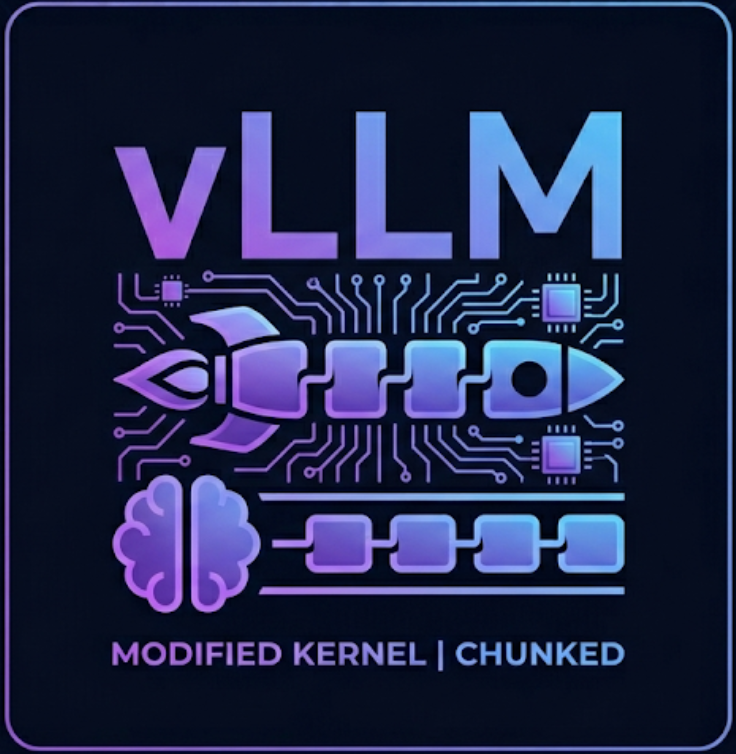

<p align="center">
  
</p>

# nano-vLLM-ly

A compact LLM inference engine for studying production inference internals. This fork extends
[nano-vllm](https://github.com/GeeeekExplorer/nano-vllm) with a token-budgeted chunked-prefill
scheduler and handwritten BF16 CUDA attention kernels for both prefill and paged decode.

The project is intentionally small enough to read end to end: request scheduling, prefix caching,
paged KV-cache allocation, tensor parallelism, CUDA Graph decode, model execution, and sampling are
all visible in a few focused modules.

## Engineering highlights

- **Chunked prefill with decode priority.** Long prompts are split into configurable token chunks,
  mixed with active decode requests, and bounded by a per-step token budget.
- **Handwritten Tensor Core attention.** BF16 WMMA kernels implement variable-length causal
  prefill, paged-KV chunk continuation, GQA, and partitioned paged decode.
- **Backend adapter.** The same model path can select official FlashAttention or the custom CUDA
  backend through an explicit `LLM(..., custom_kernel=True)` configuration—also in spawned tensor-
  parallel workers.
- **Paged KV cache and prefix reuse.** Logical sequence blocks map to physical cache pages with
  reference counting and hash-based prefix matching. The final prompt block is deliberately
  recomputed so a full cache hit still produces next-token logits.
- **Reproducible validation.** CPU scheduler tests cover chunk boundaries, mixed batching,
  preemption, token budgets, and prefix-cache edge cases. GPU tests compare custom kernels against
  FlashAttention for unpaged prefill, non-contiguous paged prefill, decode, GQA, and non-default
  CUDA streams.

## Architecture

```text
prompts -> Scheduler -----> ModelRunner -> Qwen3 -> Sampler -> token outputs
             |                  |
             v                  v
        BlockManager       Attention backend
        (paged KV +        (FlashAttention or
         prefix cache)      custom CUDA/WMMA)
```

Chunked mode treats `max_num_batched_tokens` as a hard step budget. Existing decode sequences are
scheduled first at one token each; remaining capacity is assigned to prompt chunks no larger than
`prefill_chunk_size`. See [architecture.md](docs/architecture.md) for state transitions and cache
invariants.

## Supported custom-kernel contract

| Capability | Support |
| --- | --- |
| Data type | BF16 |
| Head dimensions | 64, 128 |
| Attention mask | Causal |
| Query layout | Variable-length packed prefill; one-token decode |
| KV layout | Contiguous or paged prefill; paged decode |
| GQA/MQA | Yes, when query heads are divisible by KV heads |
| Dropout / sliding window / ALiBi / softcap | Not implemented; rejected explicitly |

Unsupported modes fail fast instead of silently falling back or producing ambiguous results.

## Quick start

Requirements: Linux, an NVIDIA GPU with BF16 Tensor Core support, CUDA toolkit, Python 3.10–3.12,
and a local Hugging Face model. The validated development environment is an RTX 3060 Laptop GPU,
PyTorch 2.5.1+cu121, CUDA toolkit 12.x, and Qwen3-0.6B.

```bash
python -m pip install -e .
TORCH_CUDA_ARCH_LIST="8.6" python -m pip install -e nanovllm/custom --no-build-isolation
```

Run the baseline or enable either extension explicitly:

```bash
python example.py --model ~/huggingface/Qwen3-0.6B
python example.py --model ~/huggingface/Qwen3-0.6B --chunked-prefill
python example.py --model ~/huggingface/Qwen3-0.6B --chunked-prefill --custom-kernel
```

Important engine options:

```python
from nanovllm import LLM

llm = LLM(
    "~/huggingface/Qwen3-0.6B",
    chunked_prefill=True,
    prefill_chunk_size=256,
    max_num_batched_tokens=4096,
    custom_kernel=True,
)
```

Configuration is carried by the engine instance rather than module-level globals, so each worker
observes the same backend and scheduler policy.

## Validation

```bash
# Scheduler/cache tests (no model execution)
python -m unittest tests.test_scheduler -v

# CUDA kernel differential tests against official FlashAttention
python -m unittest tests.test_custom_attention -v

# Syntax check for the complete repository
python -m compileall -q nanovllm benchmarks tests
```

On the validated RTX 3060 environment, the differential suite passes for BF16 GQA prefill and
decode, including a 301-token context stored in non-contiguous physical pages. Observed maximum
absolute error was at most `0.00390625` in prefill and `0.0009765625` in decode; tests use
`atol=rtol=0.05` to account for BF16 accumulation/order differences. Full methodology and expected
coverage are documented in [correctness.md](docs/correctness.md).

## Benchmarks

The benchmark scripts print machine-readable JSON and accept explicit workload/configuration
arguments:

```bash
# Kernel latency and numerical error
python -m benchmarks.benchmark_attention

# End-to-end output throughput
python -m benchmarks.benchmark_throughput --num-seqs 32
python -m benchmarks.benchmark_throughput --num-seqs 32 --custom-kernel

# Decode interference from an arriving long prompt
python -m benchmarks.benchmark_chunked_prefill \
  --output benchmarks/results/legacy.csv
python -m benchmarks.benchmark_chunked_prefill --chunked-prefill \
  --output benchmarks/results/chunked.csv

# Peak allocated memory
python -m benchmarks.benchmark_memory --prompt-tokens 2048
python -m benchmarks.benchmark_memory --prompt-tokens 2048 --chunked-prefill
```

Run alternatives in fresh processes, keep model/workload/seed identical, and report the generated
JSON rather than a hand-copied best run. See [benchmarking.md](docs/benchmarking.md).
An auditable single-machine validation snapshot, including negative results and trade-offs, is in
[validated-results.md](docs/validated-results.md).

## Repository map

```text
nanovllm/engine/       scheduler, sequence lifecycle, paged-block manager, model runner
nanovllm/layers/       attention routing, KV-cache store, tensor-parallel layers
nanovllm/custom/       Python adapter, PyTorch CUDA extension, WMMA kernels
benchmarks/            kernel, throughput, latency-interference, and memory benchmarks
tests/                 scheduler/cache unit tests and CUDA differential tests
docs/                  architecture, correctness, benchmarking, and resume/interview notes
```

## Scope and limitations

This is an educational inference engine, not a drop-in production server. It currently targets
Qwen3-style decoder models, local/offline weights, single-node execution, and sampling-only output.
It does not yet provide an HTTP serving layer, continuous request cancellation, quantization,
speculative decoding, or distributed multi-node fault tolerance. These constraints are explicit so
benchmark and resume claims remain defensible.

## Lineage and license

Based on [GeeeekExplorer/nano-vllm](https://github.com/GeeeekExplorer/nano-vllm). The scheduler,
chunked-prefill integration, custom CUDA attention path, validation suite, and benchmark/documentation
work in this fork are maintained separately. Released under the [MIT License](LICENSE).
